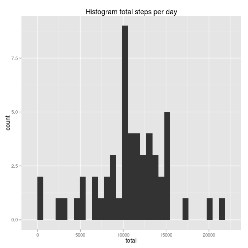

## Loading libraries

```r
## Load libraries
library(dplyr, quietly = TRUE, warn.conflicts = FALSE)
library(ggplot2)
```

## Loading and preprocessing the data

```r
unzip ("./activity.zip")
file <- read.csv("./activity.csv")
ds1 <- file %>% mutate(date = as.Date(date))
head(ds1)
```

```
##   steps       date interval
## 1    NA 2012-10-01        0
## 2    NA 2012-10-01        5
## 3    NA 2012-10-01       10
## 4    NA 2012-10-01       15
## 5    NA 2012-10-01       20
## 6    NA 2012-10-01       25
```


## What is mean total number of steps taken per day?
Histogram of the total number of steps taken each day.

```r
ds2 <- ds1 %>% group_by(date) %>% summarize(total = sum(steps, na.rm = TRUE))
head(ds2)
```

```
## Source: local data frame [6 x 2]
## 
##         date total
## 1 2012-10-01     0
## 2 2012-10-02   126
## 3 2012-10-03 11352
## 4 2012-10-04 12116
## 5 2012-10-05 13294
## 6 2012-10-06 15420
```

```r
qplot(total, data = ds2, main = "Histogram of steps taken each day")
```

 

Mean and median total number of steps taken per day.

```r
ds2 %>% summarize(avg = mean(total, na.rm = TRUE), med = median(total, na.rm = TRUE))
```

```
## Source: local data frame [1 x 2]
## 
##       avg   med
## 1 9354.23 10395
```


## What is the average daily activity pattern?
Time series plot of the 5-minute interval (x-axis) and the average number of steps taken, averaged across all days (y-axis)

```r
ds4 <- ds1 %>% group_by(interval) %>% summarize(avg = mean(steps, na.rm = TRUE))
head(ds4)
```

```
## Source: local data frame [6 x 2]
## 
##   interval       avg
## 1        0 1.7169811
## 2        5 0.3396226
## 3       10 0.1320755
## 4       15 0.1509434
## 5       20 0.0754717
## 6       25 2.0943396
```

```r
qplot(interval, avg, data = ds4, geom = "line", ylab = "Steps",
      main = "Average number of steps taken")
```

 

5-minute interval, on average across all the days in the dataset, with the maximum number of steps.

```r
ds4 %>% filter(avg == max(ds4$avg))
```

```
## Source: local data frame [1 x 2]
## 
##   interval      avg
## 1      835 206.1698
```


## Imputing missing values
Total number of missing values in the dataset.

```r
## Missing values in the dataset
sum(is.na(ds1$steps))
```

```
## [1] 2304
```

Select median for the 5-min interval to fill in values.

```r
## Median for each 5-min interval
ds5 <- ds1 %>% group_by(interval) %>% summarize(med = median(steps, na.rm = TRUE))
head(ds5)
```

```
## Source: local data frame [6 x 2]
## 
##   interval med
## 1        0   0
## 2        5   0
## 3       10   0
## 4       15   0
## 5       20   0
## 6       25   0
```

Time series plot of median 5-min interval.

```r
## Time series plot
qplot(interval, med, data= ds5, geom = "line", ylab = "Steps",
      main = "Median 5-minute interval")
```

 

Filling in missing values with the median for the 5-min interval.

```r
## Missing values filling in
ds6 <- ds1 %>% group_by(interval) %>% mutate(med = median(steps, na.rm = TRUE)) %>%
    mutate(steps_med = ifelse(is.na(steps), med, steps))
ds7 <- ds6 %>% select(date, interval, steps_med)
head(ds7)
```

```
## Source: local data frame [6 x 3]
## Groups: interval
## 
##         date interval steps_med
## 1 2012-10-01        0         0
## 2 2012-10-01        5         0
## 3 2012-10-01       10         0
## 4 2012-10-01       15         0
## 5 2012-10-01       20         0
## 6 2012-10-01       25         0
```

Histogram of the total number of steps taken each day.

```r
## Number of steps taken each day
ds8 <- ds7 %>% group_by(date) %>% summarize(total = sum(steps_med))
head(ds8)
```

```
## Source: local data frame [6 x 2]
## 
##         date total
## 1 2012-10-01  1141
## 2 2012-10-02   126
## 3 2012-10-03 11352
## 4 2012-10-04 12116
## 5 2012-10-05 13294
## 6 2012-10-06 15420
```

```r
qplot(total, data = ds8, main = "Histogram of steps taken each day")
```

 

Mean and median total number of steps taken per day.

```r
ds8 %>% summarize(avg = mean(total), med = median(total))
```

```
## Source: local data frame [1 x 2]
## 
##        avg   med
## 1 9503.869 10395
```
Mean is higher. Median keeps the same.

## Are there differences in activity patterns between weekdays and weekends?

```r
## Set locale
Sys.setlocale("LC_TIME", locale = "en_US.UTF-8")
```

```
## [1] "en_US.UTF-8"
```

```r
## Weekdays
ds10 <- ds7 %>% mutate(weekday = weekdays(date))

## Weekdays as weekend, weekday
ds11 <- ds10 %>% mutate(wd = as.factor(
    ifelse(weekday %in% c("Saturday", "Sunday"), "weekend", "weekday")))
head(ds11)
```

```
## Source: local data frame [6 x 5]
## Groups: interval
## 
##         date interval steps_med weekday      wd
## 1 2012-10-01        0         0  Monday weekday
## 2 2012-10-01        5         0  Monday weekday
## 3 2012-10-01       10         0  Monday weekday
## 4 2012-10-01       15         0  Monday weekday
## 5 2012-10-01       20         0  Monday weekday
## 6 2012-10-01       25         0  Monday weekday
```

Time series plot of the 5-minute interval (x-axis) and the average number of steps taken, averaged across all weekday days or weekend days.

```r
## Averaged across all weekday days or weekend
ds12 <- ds11 %>% group_by(interval, wd) %>% summarize(avg = mean(steps_med))
head(ds12)
```

```
## Source: local data frame [6 x 3]
## Groups: interval
## 
##   interval      wd       avg
## 1        0 weekday 2.0222222
## 2        0 weekend 0.0000000
## 3        5 weekday 0.4000000
## 4        5 weekend 0.0000000
## 5       10 weekday 0.1555556
## 6       10 weekend 0.0000000
```

```r
qplot(interval, avg, data = ds12, facets = wd ~ ., geom = "line", ylab = "Steps",
      main = "Average number of steps taken")
```

 
